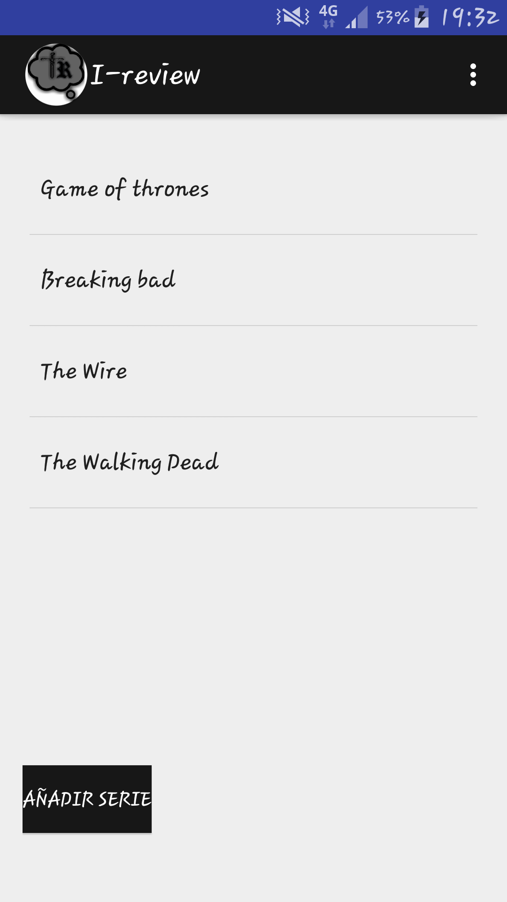

# I-review

 

Aplicación móvil para Android utilizada para organizar las series que está viendo el usuario. 
Pudiendo controlar su progreso, además de poder hacer críticas a capítulos específicos y marcar los capítulos que ha visto hasta el momento. 
La aplicación ha sido desarrollada en java en el IDE Android Studio y ejecutado en un ADV Android 7.0(Nougat) API level 25  
Desarrollada con fines académicos 

 

